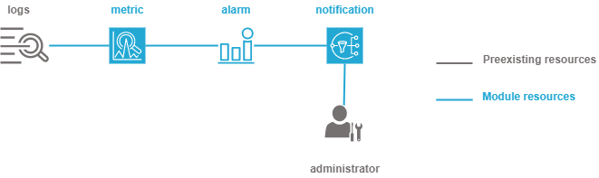

.. image:: docs/imgs/logo.png
   :alt: Logo

===================================================
AWS metrics terraform module
===================================================

About The Project
=================

This project contains all the infrastructure as code (IaC) to define metrics from logs, trigger alarms on metrics and notify administrators

.. image:: https://badgen.net/github/checks/nadegelemperiere-aws/module-aws-metrics
   :target: https://github.com/nadegelemperiere-aws/module-aws-metrics/actions/workflows/release.yml
   :alt: Status
.. image:: https://img.shields.io/static/v1?label=license&message=MIT&color=informational
   :target: ./LICENSE
   :alt: License
.. image:: https://badgen.net/github/commits/nadegelemperiere-aws/module-aws-metrics/main
   :target: https://github.com/nadegelemperiere-aws/robotframework
   :alt: Commits
.. image:: https://badgen.net/github/last-commit/nadegelemperiere-aws/module-aws-metrics/main
   :target: https://github.com/nadegelemperiere-aws/robotframework
   :alt: Last commit

Built With
----------

.. image:: https://img.shields.io/static/v1?label=terraform&message=1.6.4&color=informational
   :target: https://www.terraform.io/docs/index.html
   :alt: Terraform
.. image:: https://img.shields.io/static/v1?label=terraform%20AWS%20provider&message=5.26.0&color=informational
   :target: https://registry.terraform.io/providers/hashicorp/aws/latest/docs
   :alt: Terraform AWS provider

Getting Started
===============

Prerequisites
-------------

A loggroup shall have been created for metrics to be built from logs.

Configuration
-------------

To use this module in a wider terraform deployment, add the module to a terraform deployment using the following module:

.. code:: terraform

    module "metrics" {

        source            = "git::https://github.com/nadegelemperiere-aws/module-aws-metrics?ref=<this module version"
        project           = the project to which the permission set belongs to be used in naming and tags
        module            = the project module to which the permission set belongs to be used in naming and tags
        email             = the email of the person responsible for the permission set maintainance
        environment       = the type of environment to which the permission set contributes (prod, preprod, staging, sandbox, ...) to be used in naming and tags
        git_version       = the version of the deployment that uses the permission sets to be used as tag
        account           = AWS account to allow access to root by default
        service_principal = technical IAM account used for automation that shall be able to access the bucket
        name              = name to give to the alarm set
        cloudwatch        = {
            name = name of the loggroup on which metrics shall be derived
            role = role to use to access loggroup
        }
        logs_to_metrics = [List of metrics to create from logs
            {
                filter     = Filter to use to select the logs input from which the matric will be derived
                namespace  = Metrics namespace to which the metric shall be associated
                name       = Metric name
                value      = Value to give metric on filtered values
                unit       = Unit to give to the metric
                dimensions = Parameters upon which the user shall be able to filter the metric
            }
        ]
        metrics_to_alarms = [
            {
                metric      = Metric to derive alarm from
                evaluation  = Number of evaluation period upon which the metric shall be alarming to result into a real alarm
                operator    = Comparison operator to use to define alarming metrics
                namespace   = Namespace of the metrics to derive alarm from
                period      = Period for the metric analysis
                statistic   = Metric fusion to use on the period (sum, max, min,...)
                threshold   = Threshold to compare with the merged metric to decide on alarm
                description = Alarm description
            }
       ]
       alarms_emails        = [list of email addresses to notify on alarm]

   }

Usage
-----

The module is deployed alongside the module other terraform components, using the classic command lines :

.. code:: bash

    terraform init ...
    terraform plan ...
    terraform apply ...

Detailed design
===============

The module enables to derive metrics from logs stored in a cloudwatch loggroup. Then, alarms may be derived from rules on metrics.
Subscription is defined to send encrypted emails to a list of administrators.

Testing
=======

Tested With
-----------

.. image:: https://img.shields.io/static/v1?label=aws_iac_keywords&message=v1.5.0&color=informational
   :target: https://github.com/nadegelemperiere-aws/robotframework
   :alt: AWS iac keywords
.. image:: https://img.shields.io/static/v1?label=python&message=3.12&color=informational
   :target: https://www.python.org
   :alt: Python
.. image:: https://img.shields.io/static/v1?label=robotframework&message=6.1.1&color=informational
   :target: http://robotframework.org/
   :alt: Robotframework
.. image:: https://img.shields.io/static/v1?label=boto3&message=1.29.3&color=informational
   :target: https://boto3.amazonaws.com/v1/documentation/api/latest/index.html
   :alt: Boto3

Environment
-----------

Environment
-----------

Tests can be executed in an environment :

* in which python and terraform has been installed, by executing the script `scripts/robot.sh`_, or

* in which docker is available, by using the `aws infrastructure image`_ in its latest version, which already contains python and terraform, by executing the script `scripts/test.sh`_

.. _`aws infrastructure image`: https://github.com/nadegelemperiere-docker/terraform-python-awscli
.. _`scripts/robot.sh`: scripts/robot.sh
.. _`scripts/test.sh`: scripts/test.sh

Strategy
--------

The test strategy consists in terraforming test infrastructures based on the metrics module and check that the resulting AWS infrastructure matches what is expected.
The tests currently contains 3 tests :

1 - A test to check the capability to create metrics without alarm

2 - A test to check the capability to create alarm without notification

3 - A test to check the capability to create metrics, alarms and notification

The tests cases :

* Apply terraform to deploy the test infrastructure

* Use specific keywords to model the expected infrastructure in the boto3 format.

* Use shared SSO keywords based on boto3 to check that the boto3 input matches the expected infrastructure

NB : It is not possible to completely specify the expected infrastructure, since some of the value returned by boto are not known before apply. The comparaison functions checks that all the specified data keys are present in the output, leaving alone the other undefined keys.

Results
-------

The test results for latest release are here_

.. _here: https://nadegelemperiere-aws.github.io/module-aws-metrics/report.html

Issues
======

.. image:: https://img.shields.io/github/issues/nadegelemperiere-aws/module-aws-metrics.svg
   :target: https://github.com/nadegelemperiere-aws/module-aws-metrics/issues
   :alt: Open issues
.. image:: https://img.shields.io/github/issues-closed/nadegelemperiere-aws/module-aws-metrics.svg
   :target: https://github.com/nadegelemperiere-aws/module-aws-metrics/issues
   :alt: Closed issues

Roadmap
=======

N.A.

Contributing
============

.. image:: https://contrib.rocks/image?repo=nadegelemperiere-aws/module-aws-metrics
   :alt: GitHub Contributors Image

We welcome contributions, do not hesitate to contact us if you want to contribute.

License
=======

This code is under MIT License.

Contact
=======

Nadege LEMPERIERE - nadege.lemperiere@gmail.com

Project Link: `https://github.com/nadegelemperiere-aws/module-aws-metrics`_

.. _`https://github.com/nadegelemperiere-aws/module-aws-metrics`: https://github.com/nadegelemperiere-aws/module-aws-metrics

Acknowledgments
===============

N.A.
